# Bitez - System Flow & Developer Skill Guide

This document provides a comprehensive end-to-end walkthrough of the **Bitez** canteen ordering application, detailing its UI/UX structures, backend flows, and the technical patterns ("skills") established in this codebase.

---

## 1. End-to-End Application Flow

The app operates via three main components: the **Customer App** (React), the **Seller Portal** (React), and the **Mobile Scanner / Thermal Printer API** (Supabase Deno Edge Functions).

```mermaid
sequenceDiagram
    autonumber
    actor Customer as Customer (React)
    actor Seller as Seller / Staff (React)
    actor Scanner as Flutter Scanner App
    participant DB as Supabase Database
    participant Edge as Deno Edge Functions

    Customer->>Edge: 1. Checkout (op: "create_upi" / fallback client insert)
    DB-->>Customer: 2. Order created (status: "pending" / "qr_generated")
    Customer->>Customer: 3. Displays QR screen (realtime listen on order status)
    
    rect rgb(30, 30, 40)
        note right of Scanner: Scan order QR code on customer phone
        Scanner->>Edge: 4. API Request: scan-order (API key + qr_code)
        Edge->>DB: 5. Fetch order & verify canteen ID
        Edge->>DB: 6. Update order status to "scanned"
        Edge-->>Scanner: 7. Return print-ready thermal receipt text
    end

    DB-->>Customer: 8. Realtime sync updates status to "scanned"
    Customer->>Customer: 9. "Pay Now" button revealed -> Launch UPI app
    Customer->>DB: 10. Update status to "preparing" (payment confirmed)
    Seller->>DB: 11. Dashboard updates in realtime -> Prep starts
```



---

## 2. UI/UX & Routing Architecture

### A. Customer App Paths
- **Authentication (`/app/login`, `/app/signup`)**: Custom login/signup bypassing standard Supabase Auth (using custom credentials stored in the `public.users` table). Session data is stored in the browser's `localStorage` via the `sessionManager`.
- **Canteen & Menu browsing (`/app/home`, `/app/menu/:id`)**: Displays canteens and allows real-time cart selection.
- **Cart (`/app/cart`)**: Allows adjusting item quantities and clearing cart items.
- **Finalize Checkout (`/app/payment`)**:
  - **Cash (COD)**: Validates canteen time windows server-side and routes order creation through `analytics-orders` Edge Function.
  - **UPI payment**: Generates a local UUID, calls the Edge Function to insert the order, and falls back to direct client-side insert if Edge Functions are offline.
- **Scan Verification Screen (`/order-qr?id=ORDER_ID`)**: Renders custom payment details and listens to DB changes in real-time. Changes status from `pending` -> `scanned` (shows "Pay Now" button) -> `preparing` (redirects to status screen).
- **Status Dashboard (`/app/order-status`)**: Displays active prep status.

### B. Seller Portal Paths
- **Seller Login (`/seller/login`)**: Custom credentials verification using a secure database RPC (`verify_seller_password`).
- **Dashboard & Orders (`/seller/dashboard`, `/seller/orders`)**: Real-time dashboard showing incoming orders. Includes a simulated scanner button to process scans from the desktop portal.
- **Inventory & Settings (`/seller/inventory`, `/seller/settings`)**: Manage active stock and items. Settings tab displays API keys (`x-api-key`) for connecting physical Flutter scanners.

---

## 3. Flutter Scanner & Thermal Printer API

Physical Android/iOS scanner devices interface with the database via the Deno `scan-order` Edge Function:

1. **Authentication**: Mobile scanners authenticate using the `x-api-key` header matching records in the `canteen_scanners` table.
2. **Scan Processing**: The scanner posts the scanned QR UUID (`qr_code`). The function checks if the order is already processed, updates the database status to `scanned`, and logs the device metadata.
3. **Thermal Printing**: The function returns a plain-text thermal-ready receipt payload formatted with line characters, center padding, and rupees (`Rs.`) alignments. The scanner pipes this directly to the thermal printer via Bluetooth/USB.

---

## 4. Key Developer Patterns ("Skills")

These established patterns are used throughout the project to maintain security, compatibility, and speed:

### Skill 1: RLS Bypass using Serverless Proxies
Since both customers and sellers authenticate via custom database columns rather than standard Supabase Auth, they are anonymous (`auth.uid() = null`) in the context of Supabase client policies. To secure table modifications:
- Avoid direct database writes from the client on restricted tables.
- Route inserts/updates through serverless Deno Edge Functions using the `service_role` client (`adminClient`) which naturally bypasses RLS rules on the server.

### Skill 2: Resilient Client-Side Fallbacks
To protect checkout and scan operations if Edge Functions go offline or fail to deploy:
- Implement a try-catch block wrapping the Edge Function call.
- If it fails, fall back to executing a direct client-side database query/update as a backup:
```typescript
try {
  // 1. Try server-side Edge Function first
  const { data } = await supabase.functions.invoke("scan-order", { body: { qr_code } });
  if (!data?.success) throw new Error();
} catch {
  // 2. Fall back to client-side database query if server is offline
  await supabase.from("orders").update({ status: "confirmed" }).eq("id", orderId);
}
```

### Skill 3: Migration-less Metadata Serialization
To store custom, dynamic data points (such as the cart items snapshot, payment metadata, or scanner telemetry) without triggering schema cache errors:
- Store values as a serialized JSON string in a standard, pre-existing database text column (e.g., `notes`).
- The client and server simply run `JSON.stringify` on write and `JSON.parse` on read. This avoids adding new database columns which might fail to resolve on remote clients due to PostgREST schema cache lags.

### Skill 4: Time-based Stock Checking & Safe Reduction
To prevent ghost orders and race conditions during peak hours:
- Check items stock right before persisting the order using Deno backend queries.
- Execute stock decrement using a database RPC function (`reduce_seller_stock`) to perform atomic decreases on the database server.
